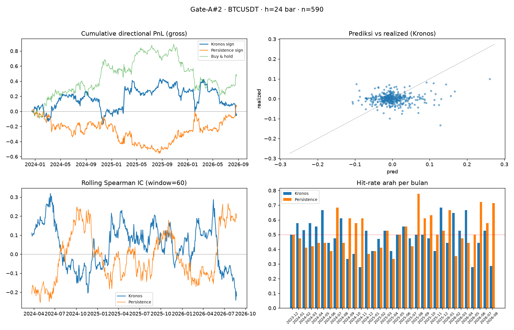
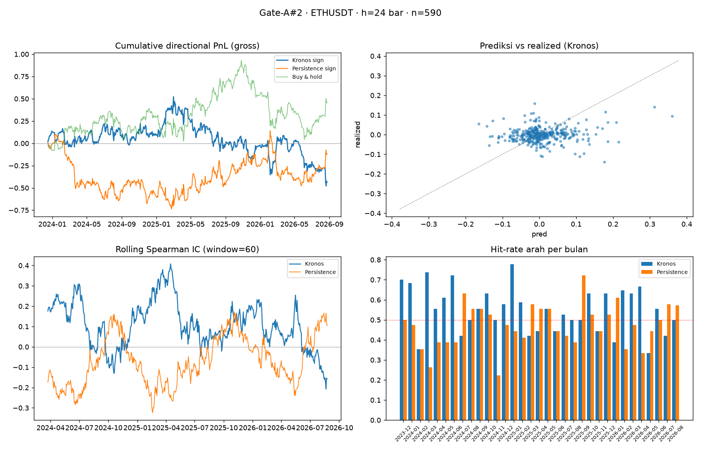

# SEITH · AI Hedge Fund (paper-trading)

`SEITH` = personal AI hedge fund platform. AI multi-agent (TradingAgents + Groq/OpenRouter) →
Kronos price-forecast (GPU lokal RTX 4050) → backtest (vectorbt-style walk-forward) →
paper execution (nautilus_trader sandbox). Kontrol via **Telegram bot @SeithAI_bot**
atau dashboard web. Mode operasi: **paper trading penuh** — live trading terkunci di balik
gerbang go-live (lihat `docs/PRD.md`).

> ⚠️ Repo ini **source-available, bukan community project**. Lihat [CONTRIBUTING](#contributing)
> dan [LICENSE](#lisensi).

## Struktur

```
apps/
  api/       FastAPI hub + Telegram bot (B1-B4)      ← interaksi manusia
  analysis/  Kronos forecast + TradingAgents + backtest
  trader/    nautilus_trader node (SignalActor→RiskMgr→SandboxExec)
  dashboard/ Next.js 15 web UI
packages/
  seith-core   domain schemas (Pydantic, frozen, extra=forbid) — KONTRAK semua service
  seith-data   ingestion (Binance/OANDA/yfinance) + Parquet/SQLite store
vendor/       Kronos + TradingAgents (fork ter-pin, jangan git pull vendor)
docs/         PRD · ADR · workflow .mmd · kronos-notes
.handoff/     checkpoint sesi (gitignored)
```

## Mulai (dev)

```powershell
# tiap app adalah proyek uv INDEPENDEN (bukan workspace). Jalankan dari dalam dir proyek.
cd apps\api          ; uv sync ; uv run python -m seith_api.bot           # bot
cd apps\trader       ; uv sync ; uv run python -m seith_trader.node        # trader node
cd apps\analysis     ; uv sync ; uv run python -m seith_analysis.run_analysis --ticker BTCUSDT
```

Env (wajib sebelum run, dari root repo):

```
$env:SEITH_ENV_FILE="C:\Users\Lenovo\PROJECT\SEITH\.env"
$env:SEITH_DATA_DIR ="C:\Users\Lenovo\PROJECT\SEITH\data"
$env:SEITH_DB_PATH  ="C:\Users\Lenovo\PROJECT\SEITH\data\seith.db"
```

Gotcha lihat `AGENTS.md` §5 (uv multi-env, never sync from root, reinstall-package setelah tambah file).

## Testing

- **Satuan**: `uv run pytest` dari tiap app dir (lint via `uvx ruff check .`).
- **TB#1 (end-of-phase e2e)**: `/analyze BTCUSDT` penuh + tes interaksi bot dari HP.

## Gate-A#2 — Hasil Backtest Kronos (h=24 bar, 1H)

Evaluasi formal model prediksi harga Kronos (AAAI 2026) melawan data 1H Binance,
walk-forward anti-leak (`n=590` per pair, horizon 24 bar). Threshold GO sudah
di-pre-register: RankIC ≥ +0.10 · hit-rate ≥ 55%.

| Pair | RankIC Kronos | RankIC persist | Hit Kronos | Hit persist | Verdict |
|---|---|---|---|---|---|
| BTCUSDT | +0.022 | −0.013 | 48.98% | 51.53% | **tanpa edge** |
| ETHUSDT | +0.088 (p<0.05) | −0.061 | 55.0% | 47.3% | **edge tipis nyata** |

Visual (tearsheet, 4 panel — PnL kumulatif, pred-vs-realized scatter, rolling IC,
hit-rate bulanan):




> Lihat notebook `research/gate_a2_analysis.ipynb` + artefak mentah
> `research/gate-a2-formal-{BTCUSDT,ETHUSDT}-h24.txt` untuk detail run.
> Verdict formal: penuhi threshold ETHUSDT (edge tipis), belum memuaskan BTCUSDT;
> keputusan produksi tetap menunggu pre-register full 5-pair.

  Butuh kuota OpenRouter (reset harian 07:00 WIB) + GPU lokal. Lihat `.handoff/TB1-test-plan.md`.

## Contributes / Lisensi

### Contributing — CLOSED (Kebijakan Kolaborasi)
Repo ini **source-available open-source** (GPL-3.0) tapi kolaborasi adalah **invite-only
eksklusif founder**. Tidak ada PR, issue, atau intervensi pihak ketiga yang diterima,
dipertimbangkan, atau dipengaruhi tanpa izin tertulis founder. Ini kebijakan di atas
lisensi (Terms-of-Use / kebijakan repositori), bukan pembatasan hak lisensi. Founder
adalah satu-satunya orang yang mengontrol arah dan isi repository ini "untuk jadi".

Lisensi GPL-3.0 tetap memberi orang hak untuk **membaca, menjalankan, dan menyalin**
source secara gratis — kolaborasi (modifikasi-untuk-upstream / fork-management /
third-party interference) tidak termasuk dalam lisensi ini dan disisihkan kebijakan.

### Lisensi
[`LICENSE`](LICENSE) — **GNU General Public License v3.0**. Strong copyleft; semua
right to distribute/modify tetap ada, tapi hak kolaborasi dan governance repositori
disisihkan eksklusif ke founder (lihat kebijakan di atas).

Lihat `docs/adr/0004-license-and-collaboration-policy.md` untuk justifikasi pemilihan
lisensi dan keputusan yang dibuang (custom license vs GPL, OSI-strict vs source-available).

---
*Mode awal = paper trading. Keputusan go-live hanya melalui approval manusia (Tier-0).*
