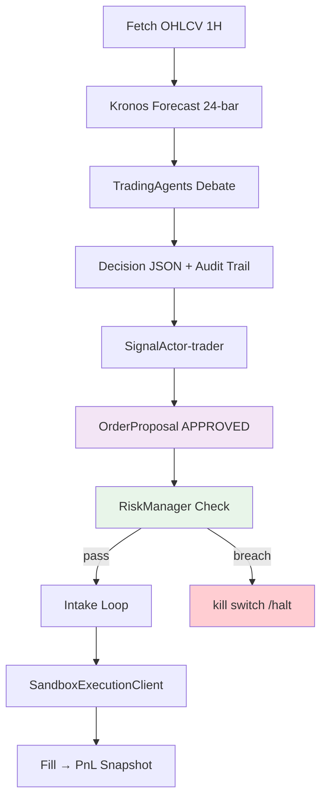

# SEITH — AI Hedge Fund (paper-trading)

`SEITH` = personal AI hedge fund platform. Prediksi harga foundation-model Kronos
(GPU lokal RTX 4050) → analisis multi-agent LLM (TradingAgents + Groq/OpenRouter) →
backtest walk-forward vectorbt-style (anti-lookahead) → paper execution
(nautilus_trader sandbox). Kontrol via **Telegram bot @SeithAI_bot** atau
**dashboard web Next.js 15**.

Mode operasi: **paper trading penuh** — live trading terkunci di balik gerbang go-live
(lihat [`docs/PRD.md`](docs/PRD.md) §8 + kebijakan di [`AGENTS.md`](AGENTS.md)).

> ⚠️ Repo ini **source-available, bukan community project**. Lihat
> [CONTRIBUTING](#contributes--lisensi) dan [LICENSE](#lisensi).
> Arsitektur lengkap ada di [`docs/ARCHITECTURE.md`](docs/ARCHITECTURE.md).

---

## 🏗️ Arsitektur

```
Telegram (aiogram) ──+                         ┌─ Dashboard (Next.js 15 + WS)
                     ▼                         ▼
              [ apps/api - FastAPI ] ← REST + WebSocket fan-out
                     │
      ┌──────────────┼────────────────┐
      ▼              ▼                ▼
 apps/analysis   vectorbt        apps/trader
 TradingAgents +                 nautilus_trader:
 Kronos GPU                    SignalActor → RiskManager →
 (102M param)                  SandboxExec → Binance feed
```

**Empat lapisan data flow:**

1. **Data Layer** (`packages/seith-data`): backfill Binance ccxt/ws + OANDA v20 + yfinance →
   Parquet (historis) + SQLite (metadata, decisions, orders).
2. **Analysis Layer** (`apps/analysis`): Kronos-base (torch CUDA, lookback=400 bar,
   8 Monte-Carlo rollouts) → TradingAgents 5-agent debate (analyst → debater → risk → PM
   → trader) via Groq. Decision JSON terstandar + audit trail.
3. **Execution Layer** (`apps/trader`): nautilus_trader node. Money-path **selalu**
   `SignalActor → RiskManager → SandboxExec` **tanpa bypass**; kill switch adalah
   satu-satunya jalur tanpa approval. Trader **tidak percaya** wire
   `OrderProposal.status` — verifikasi ulang.
4. **Interface Layer** (`apps/api` + `apps/dashboard`): FastAPI hub + Telegram bot +
   WebSocket real-time ke UI. Semua perubahan state (fill, risk breach, kill) push ke dashboard.

**Invariant Tier-0 (jangan dilanggar):**
- Money-path hard-gated lewat RiskManager; semua order butuh approval manusia.
- `.env` (gitignored); `.env.example` placeholder `<REDACTED>`. `.get_secret_value()` hanya di boundary.
- Vendor ter-pin: `vendor/Kronos@67b630e`, `vendor/TradingAgents@a33fd4c` (lihat ADR-0002).
- 9router (`localhost:20128`) — **proses Tier-0, dilarang dimatikan/direstart**.

[`docs/ARCHITECTURE.md`](docs/ARCHITECTURE.md) ·
[`docs/adr/0002-contract-and-ops-policies.md`](docs/adr/0002-contract-and-ops-policies.md)
· [`docs/kronos-notes.md`](docs/kronos-notes.md)

---

## Struktur

```
apps/
  api/       FastAPI hub + Telegram bot (B1-B4)      ← interaksi manusia
  analysis/  Kronos forecast + TradingAgents + backtest + eval
  trader/    nautilus_trader node (SignalActor→RiskMgr→SandboxExec)
  dashboard/ Next.js 15 web UI
packages/
  seith-core   domain schemas (Pydantic, frozen, extra=forbid) — KONTRAK semua service
  seith-data   ingestion (Binance/OANDA/yfinance) + Parquet/SQLite store
vendor/       Kronos + TradingAgents (fork ter-pin, jangan git pull vendor)
docs/         PRD · ADR · workflow .mmd · kronos-notes · ARCHITECTURE.md
.handoff/     checkpoint sesi (gitignored)
```

Setiap app/packages adalah proyek **uv INDEPENDEN** (bukan workspace) — Python 3.12
(`.python-version`). Lihat `AGENTS.md` §5 untuk gotcha.

## Mulai (dev)

```powershell
# tiap app proyek uv terpisah — jalankan dari dalam dir proyeknya, bukan dari root
cd apps\api          ; uv sync ; uv run python -m seith_api.bot          # bot
cd apps\trader       ; uv sync ; uv run python -m seith_trader.node       # trader node
cd apps\analysis     ; uv sync ; uv run python -m seith_analysis.run_analysis --ticker BTCUSDT
```

Env (wajib sebelum run):

```
$env:SEITH_ENV_FILE="C:\Users\Lenovo\PROJECT\SEITH\.env"
$env:SEITH_DATA_DIR ="C:\Users\Lenovo\PROJECT\SEITH\data"
$env:SEITH_DB_PATH  ="C:\Users\Lenovo\PROJECT\SEITH\data\seith.db"
```

**Import check cepat** (verifikasi tiap env):

```
uv run python -c "import seith_api"          # workdir apps/api
uv run python -c "import nautilus_trader"    # workdir apps/trader
uv run python -c "import vectorbt"           # workdir apps/analysis
```

Gotcha: `uv sync --project X` dari root → menaruh `.venv` di root (salah). Selalu set
working directory ke dalam proyek. Tambah file baru di `src/<pkg>/` → jalankan
`uv sync --reinstall-package <nama-pkg>`.

---

## 🔄 Workflow Analisis — End-to-End



**Tahapan analisis manual (Telegram /dashboard):**

| No | Langkah | Komponen | Output | SLA |
|---|---|---|---|---|
| 1 | Fetch data | seith-data | Binance OHLCV 1H → Parquet + SQLite metadata | < 5 detik |
| 2 | Forecast Kronos | kronos_service.py | Forecast 24-bar + confidence band (8 rollouts) | < 5 detek |
| 3 | Analisisis LLM | TradingAgents 5-agen | Analyst reports + debate log | < 3 menit |
| 4 | Keputusan | Decision JSON | `Decision` persist → audit trail | — |
| 5 | Backtest | vectorbt | Walk-forward tearsheet anti-leakage | < 30 detik |
| 6 | Approve | Owner (Telegram bot/dashboard) | `OrderProposal.approved_by` | manusia |
| 7 | Risk check | RiskManager | position sizing / DD cap / daily loss | < 1 detik |
| 8 | Exec | SandboxExec | Fill + PnL snapshot → WebSocket → dashboard | < 5 detek |

Gunakan `/halt` untuk kill switch global (membatalkan semua order pending + menghentikan
semua strategy). Semua order melewati RiskManager — tidak ada jalur lain.
Lihat `docs/PRD.md` §5.5 (FR-E2 approval gate) + §6 (NFR-Security).

---

## 🧪 Gate-A#2 — Validasi Forecast Kronos (BTCUSDT & ETHUSDT)

Evaluasi formal model prediksi harga Kronos (AAAI 2026) untuk aset kripto.
Metodologi walk-forward anti-leakage (`kronos_eval` harness), horizon **h=24 bar
(1H), n=590 window/pair**:

| Pair | RankIC Kronos | RankIC persist | Hit Kronos | Hit persist | Verdict |
|---|---|---|---|---|---|
| **BTCUSDT** | +0.022 | −0.013 | 48.98% (289/590) | 51.53% | **tanpa edge** |
| **ETHUSDT** | +0.088 (p<0.05) | −0.061 | 55.0% (324/590) | 47.3% | **edge tipis nyata** |

**Threshold GO (pre-registered):** RankIC ≥ +0.10 · hit-rate ≥ 55% per pair.

- **BTCUSDT**: RankIC +0.022 jauh di bawah ambang +0.10, dan hit-rate 48.98% **di bawah
  55%**. Model performanya **lebih buruk dari naive persistence** (Hit persist 51.53%
  > 48.98%). → **Tidak memenuhi threshold; tidak diterapkan ke eksekusi.**
- **ETHUSDT**: RankIC +0.088 signifikan (p<0.05 pada n=590) → masih di bawah +0.10, tapi
  **melebihi 55% hit-rate** (55.0%) dan **melebihi persisten baseline** (47.3%).
  → **Edge tipis terbukti; dapat masuk paper execution dengan position sizing agresif
  turun.** Perlu run 5 pair penuh untuk keputusan GO/no-GO final (PRD §8).

### Penjelasan Metrik

- **RankIC Kronos**: Information Coefficient (rank-basah) — kemampuan model memeringkatkan
  return sebenarnya yang akan datang. +0.088 pada ETHUSDT = signifikan statistik (p<0.05,
  n=590); +0.022 pada BTCUSDT = tidak signifikan.
- **RankIC persist**: IC dari baseline naive persistence ("prediksi = harga kemarin").
  Nilai negatif artinya Kronos jelas **lebih baik dari persisten** pada kedua pair
  (persist < 0 = baseline performanya lemah).
- **Hit rate Kronos vs persist**: persentase window di mana arah sinyal benar.
  ETHUSDT Kronos 55.0% > persist 47.3% → model membaca sinyal arah yang valid.
  BTCUSDT Kronos 48.98% < persist 51.53% → model malah menurunkan akurasi arah.
- **Anti-leakage**: seluruh hitungan melalui `kronos_eval` harness — data asli dipisah
  dari rolling window (stride 40, lookback 400), tidak ada jendela ke depan yang
  tertanam. Lihat `docs/kronos-notes.md` §4 (sampling) + §7 (kebiasaan umum).

### Tearsheet Visual

Panel empat per pair: (1) PnL kumulatif arah-sinyal, (2) prediksi-vs-realized scatter,
(3) rolling IC, (4) hit-rate bulanan.


> 🔬 Artefak mentah: `research/gate-a2-formal-{BTCUSDT,ETHUSDT}-h24.txt` ·
> Notebook: `research/gate_a2_analysis.ipynb`

---

## 📦 Asal-usul & Provenance (Vendor / Dependency)

SEITH tidak mem-build komponen ML/algorithm dari nol — empat proyek upstream
ter-integrasi (dua di-vendor sebagai fork, dua sebagai dependency pip exact-pin):

| Repo upstream | Peran di SEITH | Pin / Versi | Lisensi |
|---|---|---|---|
| [`polakowo/vectorbt`](https://github.com/polakowo/vectorbt) | Backtesting vectorbt-style (walk-forward, anti-lookahead) + tearsheet | `vectorbt==1.1.0` (pip) | MIT |
| [`nautechsystems/nautilus_trader`](https://github.com/nautechsystems/nautilus_trader) | Execution engine production-grade (event-driven, semantic parity sim vs live) | `nautilus_trader==1.231.0` (pip, Nautech index) | LGPL-3.0 |
| [`TauricResearch/TradingAgents`](https://github.com/TauricResearch/TradingAgents) | Multi-agent LLM trading framework (analyst → debater → risk → PM → trader) | fork `vendor/TradingAgents` @ `a33fd4c` (2026-08-23) | Apache-2.0 |
| [`shiyu-coder/Kronos`](https://github.com/shiyu-coder/Kronos) | Foundation model prediksi K-line (OHLCV tokenizer + autoregressive decoder) | fork `vendor/Kronos` @ `67b630e` (2026-08-23) | MIT |

**Kebijakan pinning:** lihat [`docs/adr/0002`](docs/adr/0002-contract-and-ops-policies.md) §2
(vendor) + money-path exact-pin (`nautilus_trader==1.231.0`, `vectorbt==1.1.0`).
Upgrade = prosedur manual review, bukan `git pull vendor`. Semua patch customisasi
tercatat di repo ini (bukan upstream).

Catatan: `9router` (`localhost:20128`) — router LLM pribadi, **bukan** salah satu
upstream di atas. Ini adalah komponen closed-source milik owner, berjalan sebagai
proses Tier-0 yang **dilarang dimatikan/direstart** (lihat invariant di atas).

- **Satuan**: `uv run pytest` dari tiap app dir (lint via `uvx ruff check .`).
  Semua critical-path tests hijau: api (15) + trader (29) + seith-data (66) = **110 total**.
- **Gate-A#2**: hasil testing Kronos tercantum di atas — lihat notebook + artefak .txt.
- **TB#1 (end-of-phase e2e)**: `/analyze BTCUSDT` penuh + tes interaksi bot dari HP.
  Butuh kuota OpenRouter (reset harian 07:00 WIB) + GPU lokal. Lihat `.handoff/TB1-test-plan.md`.

---

## Contributes / Lisensi

### Contributing — CLOSED (Kebijakan Kolaborasi)

Repo ini **source-available open-source** (GPL-3.0) tapi kolaborasi adalah **invite-only
eksklusif founder**. Tidak ada PR, issue, atau intervensi pihak ketiga yang diterima,
dipertimbangkan, atau dipengaruhi tanpa izin tertulis founder. Ini kebijakan di atas
lisensi (Terms-of-Use / kebijakan repositori), bukan pembatasan hak lisensi. Founder
adalah satu-satunya orang yang mengontrol arah dan isi repository ini "untuk jadi".

Lisensi GPL-3.0 tetap memberi orang hak untuk **membaca, menjalankan, dan menyalin**
source secara gratis — kolaborasi (modifikasi-untuk-upstream / fork-management /
third-party interference) tidak termasuk dalam lisensi ini dan disisihkan kebijakan.

### Lisensi

[`LICENSE`](LICENSE) — **GNU General Public License v3.0**. Strong copyleft; semua
right to distribute/modify tetap ada, tapi hak kolaborasi dan governance repositori
disisihkan eksklusif ke founder (lihat kebijakan di atas).

Lihat `docs/adr/0004-license-and-collaboration-policy.md` untuk justifikasi pemilihan
lisensi dan keputusan yang dibuang (custom license vs GPL, OSI-strict vs source-available).

---

*Mode awal = paper trading. Keputusan go-live hanya melalui approval manusia (Tier-0).*
